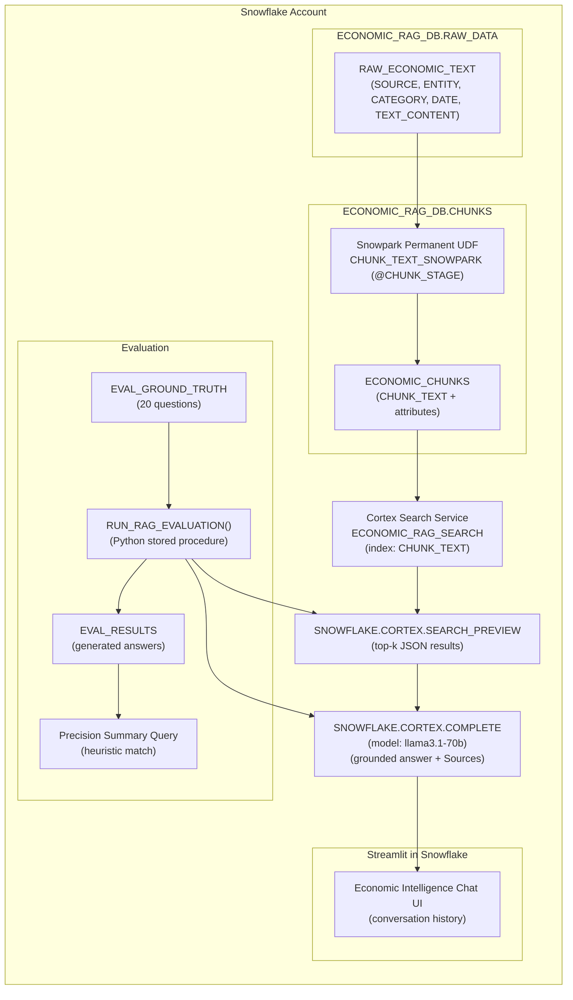

# Economic Intelligence RAG Assistant

[-7C3AED)](#)

RAG-powered **economic intelligence assistant built entirely in Snowflake** using **Snowflake Cortex Search (vector retrieval)** + **Cortex LLM completion** to deliver grounded answers with source citations over economic marketplace datasets.

> **Hackathon Submission**: TAMU CSEGSA × Snowflake Hackathon 2026  
> **Track / Prompt**: AI Prompt 01 — RAG-powered economic intelligence assistant (100 pts)  
> **Project Name**: Economic Intelligence RAG Assistant

---

## Why this project

Economic and labor datasets are broad, sparse, and high-dimensional. This assistant provides:

- **Retrieval groundedness**: Answers are generated *only* from retrieved chunks (or it says it cannot find enough info).
- **Snowflake-native execution**: Data, chunking, vector search, LLM inference, evaluation, and the UI run in Snowflake.
- **Auditable outputs**: The assistant emits a **Sources** section and the evaluation pipeline persists per-question results.

---

## Repository contents (hackathon deliverables)

These files are the required, end-to-end deliverables:

- `01_CREATE_DATABASE_AND_SCHEMAS.sql` — Database, schemas, warehouse, and raw ingestion helpers
- `01_CHUNKING_PYTHON.py` — Snowpark chunking + permanent UDF + chunk table population
- `02_CREATE_CORTEX_SEARCH_SERVICE.sql` — Cortex Search Service definition over chunk text + attributes
- `03_RAG_PIPELINE.sql` — Example grounded RAG query using `SNOWFLAKE.CORTEX.SEARCH_PREVIEW` + `SNOWFLAKE.CORTEX.COMPLETE`
- `05_ECONOMIC_INTELLIGENCE_CHAT.streamlit` — Streamlit chat app that performs retrieval + grounded completion
- `04_EVALUATION_20_QUESTIONS.sql` — 20-Q evaluation dataset + stored procedure + summary query
- `EVAL_RESULTS.csv` — Sample evaluation outputs (generated answers + expected fields)

For a cleaner write-up, see:

- `ARCHITECTURE.md` — Detailed architecture, data flow, schemas, and operational notes

---

## Architecture overview

### High-level flow

1. **Ingest / build text corpus** in `ECONOMIC_RAG_DB.RAW_DATA.RAW_ECONOMIC_TEXT`  
2. **Chunk** the text with Snowpark into `ECONOMIC_RAG_DB.CHUNKS.ECONOMIC_CHUNKS`  
3. **Index** `CHUNK_TEXT` with a **Cortex Search Service** (`ECONOMIC_RAG_SEARCH`) using attributes for filtering/citations  
4. **Retrieve** with `SNOWFLAKE.CORTEX.SEARCH_PREVIEW(...)`  
5. **Generate** a grounded response with `SNOWFLAKE.CORTEX.COMPLETE('llama3.1-70b', prompt_with_context)`  
6. **Serve** via Streamlit in Snowflake  
7. **Evaluate** using a Snowflake Python stored procedure that runs the same retrieval + completion loop over 20 questions

### Architecture diagram

### Key design choices (technical depth)

- **Snowflake-native chunking**: A **permanent Snowpark UDF** (`CHUNK_TEXT_SNOWPARK`) runs inside Snowflake, avoiding external services.
- **Vector retrieval via Cortex Search**: `ECONOMIC_RAG_SEARCH` indexes `CHUNK_TEXT` and preserves **attributes** (`SOURCE`, `COMPANY_OR_ENTITY`, `FILING_TYPE_OR_CATEGORY`, `DATE`) for traceability.
- **Grounded prompting**: The completion prompt strictly instructs the model to use only retrieved context and to explicitly return “I cannot find sufficient information…” when evidence is missing.
- **Reproducible evaluation**: All evaluation artifacts (questions, generated answers, and summary SQL) are kept in-database.

---

## Step-by-step setup (Snowflake-only)

> **Prereqs**: A Snowflake account with access to **Cortex** (Cortex Search + Cortex LLM) and permission to create databases, warehouses, and Streamlit apps.

### 1) Create database, schemas, and warehouse

Run:

- `01_CREATE_DATABASE_AND_SCHEMAS.sql`

This creates:

- `ECONOMIC_RAG_DB`
- schemas: `RAW_DATA`, `CHUNKS`
- warehouse: `RAG_WH`

### 2) Populate `RAW_ECONOMIC_TEXT`

`01_CREATE_DATABASE_AND_SCHEMAS.sql` includes example inserts that build a text corpus from **Snowflake Marketplace / public datasets** by concatenating descriptive fields into `TEXT_CONTENT`.

After loading, validate:

- row counts by `SOURCE`
- sample `TEXT_CONTENT`

### 3) Chunk the corpus with Snowpark

Run the Snowpark script:

- `01_CHUNKING_PYTHON.py`

It:

- registers permanent UDF `CHUNK_TEXT_SNOWPARK` (stored on `@CHUNK_STAGE`)
- creates `ECONOMIC_RAG_DB.CHUNKS.ECONOMIC_CHUNKS`
- inserts chunked rows from `RAW_ECONOMIC_TEXT`

### 4) Create the Cortex Search Service

Run:

- `02_CREATE_CORTEX_SEARCH_SERVICE.sql`

Wait until the service is `READY`:

- `SHOW CORTEX SEARCH SERVICES LIKE 'ECONOMIC_RAG_SEARCH';`

### 5) Run a grounded RAG query (with citations)

Run:

- `03_RAG_PIPELINE.sql`

It demonstrates:

- a simple `SEARCH_PREVIEW` smoke test
- a full grounded completion prompt with a “Sources:” section

### 6) Launch the Streamlit app (chat UI)

Use:

- `05_ECONOMIC_INTELLIGENCE_CHAT.streamlit`

The app:

- retrieves top chunks with `SEARCH_PREVIEW`
- builds a context block client-side (Snowpark in Streamlit)
- generates the answer with `CORTEX.COMPLETE`
- displays the answer + sources

### 7) Run evaluation (20 questions)

Run:

- `04_EVALUATION_20_QUESTIONS.sql`

This creates:

- `EVAL_GROUND_TRUTH` (20 questions)
- `EVAL_RESULTS` (generated outputs)
- `RUN_RAG_EVALUATION()` stored procedure to execute the evaluation loop

---

## Demo questions (examples)

These are representative of the included evaluation set:

- “What is the unit for unemployment rate?”
- “What is the frequency of Current Employment Statistics?”
- “What industry has testing laboratories and services?”
- “What does MEASUREMENT_TYPE describe?”
- “What is the definition of RELEASE_NAME?”

You can also try open-ended prompts like:

- “Summarize unemployment measures for a specific population group.”
- “Explain what seasonally adjusted means in the provided datasets.”

---

## Evaluation results (summary)

Using the included `EVAL_RESULTS.csv` and the evaluation SQL’s match heuristic (generated answer contains expected answer **or** expected entity):

- **Total questions**: 20  
- **Correct**: 17  
- **Retrieval/answer precision (heuristic)**: **85.00%**  
- **Misses**: Q6, Q9, Q17

> Note: This metric is intentionally simple and judge-friendly. See `04_EVALUATION_20_QUESTIONS.sql` for the exact computation and how results are persisted in `EVAL_RESULTS`.

---

## Live demo

- **Live demo link (placeholder)**: _TBD_ (add Streamlit in Snowflake app URL here)

---

## Dataset

- **Snowflake Marketplace dataset used**: Snowflake Data Marketplace — **Finance & Economics**

---

## Tech stack

- **Data platform**: Snowflake
- **Retrieval**: Snowflake Cortex Search (`SNOWFLAKE.CORTEX.SEARCH_PREVIEW`)
- **Generation**: Snowflake Cortex LLM (`SNOWFLAKE.CORTEX.COMPLETE`, model: `llama3.1-70b`)
- **Chunking**: Snowpark Python + permanent UDF
- **App**: Streamlit in Snowflake
- **Evaluation**: Snowflake SQL + Python stored procedure (Snowpark)

---

## Screenshots

Add screenshots under `assets/` and link them here:

- `assets/screenshot_chat.png` — Chat UI + grounded answer + sources
- `assets/screenshot_search_service_ready.png` — Cortex Search Service status = READY
- `assets/screenshot_eval_summary.png` — Evaluation summary query output

---

## License

Add your preferred license file (e.g., MIT) if required by the hackathon rules.

