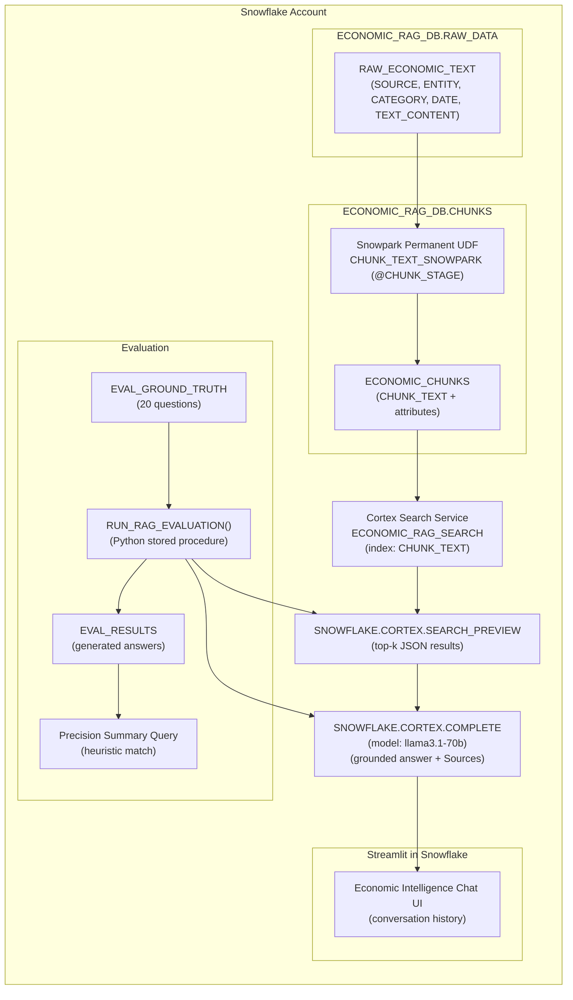

# Architecture diagram (export-ready)

If your README renderer supports Mermaid, you can copy/paste this diagram.
Otherwise, export it to an image (PNG/SVG) and save as `docs/architecture-diagram.png` (or `.svg`) for easy embedding.

